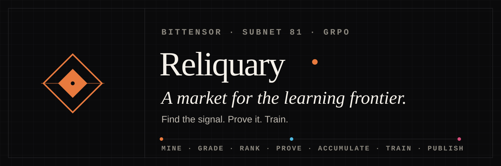
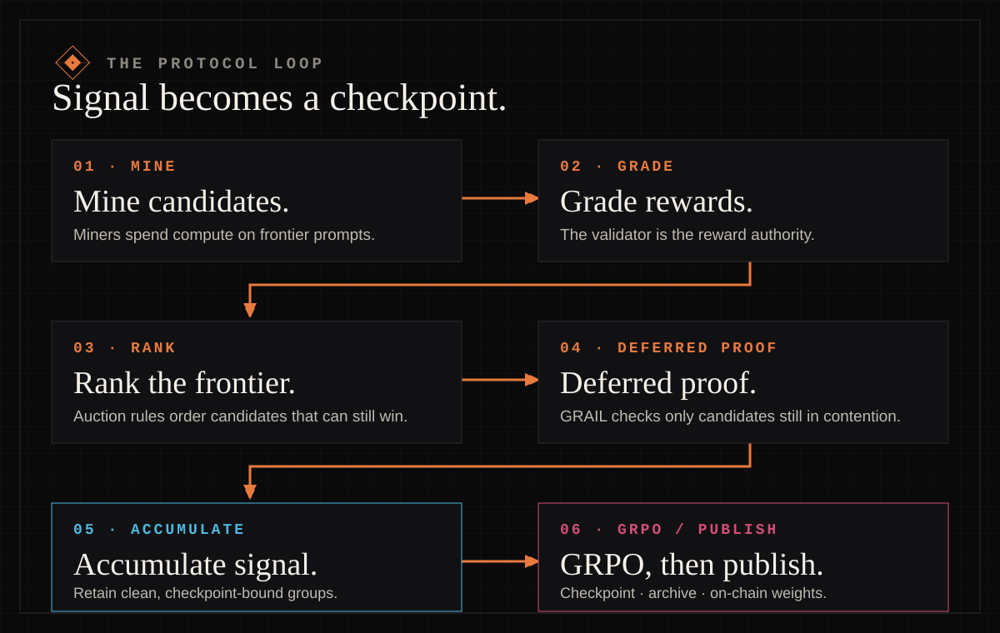

  

  <strong>Decentralized GRPO training on Bittensor's Finney network, Subnet 81.</strong>

  <a href="https://www.reliqua.ai/dashboard">Live network</a>
  ·
  <a href="https://github.com/reliquadotai/reliquary/blob/main/docs/mining.md">Run a miner</a>
  ·
  <a href="https://github.com/reliquadotai/reliquary/blob/main/docs/concepts.md">Protocol</a>
  ·
  <a href="https://www.reliqua.ai/research">Research</a>

Reliquary turns independent GPU operators into a verifiable training market.
Miners search for prompts at a model's learning frontier, the validator
recomputes the evidence, and healthy selected groups can contribute to the next
checkpoint.

## Find the signal. Prove it. Train

  

1. **Find** — miners compete to locate useful training signal before compute is
   committed.
2. **Prove** — selected candidates pass deterministic verification and
   validator-authoritative reward checks.
3. **Train** — clean, complete windows become eligible for GRPO; archives and
   checkpoint claims remain inspectable.

## Inspect production

| Surface | What it shows |
| --- | --- |
| [Live dashboard](https://www.reliqua.ai/dashboard) | Current windows, selection, rewards, and training health |
| [Proof explorer](https://www.reliqua.ai/explorer) | Public window records and validator provenance |
| [Network status](https://www.reliqua.ai/status) | Availability and data freshness |
| [Canonical source](https://github.com/reliquadotai/reliquary) | The deployed protocol and its current contract |

Live values belong on live surfaces. This profile intentionally does not freeze
changing counts, checkpoints, or projections into marketing copy.

## Build and operate

- [Mine on Subnet 81](https://github.com/reliquadotai/reliquary/blob/main/docs/mining.md)
- [Run a validator](https://github.com/reliquadotai/reliquary/blob/main/docs/validating.md)
- [Understand the mechanism](https://github.com/reliquadotai/reliquary/blob/main/docs/concepts.md)
- [Operate a private-by-default miner fleet](https://github.com/reliquadotai/reliquary-fleet)

## Repositories

### Production

| Repository | Role |
| --- | --- |
| [`reliquary`](https://github.com/reliquadotai/reliquary) | Canonical Subnet 81 protocol: mining, verification, selection, training, archives, and checkpoint publication |
| [`reliquary-fleet`](https://github.com/reliquadotai/reliquary-fleet) | Released, private-by-default operations dashboard for miner fleets |

### Reference and history

These repositories preserve earlier experiments and reusable primitives. They
are not the production Subnet 81 implementation.

| Repository | Scope |
| --- | --- |
| [`reliquary-ledger`](https://github.com/reliquadotai/reliquary-ledger) | Historical proof-carrying inference and validator-mesh testnet |
| [`reliquary-forge`](https://github.com/reliquadotai/reliquary-forge) | Historical trainer-quorum and policy-delta exploration |
| [`reliquary-protocol`](https://github.com/reliquadotai/reliquary-protocol) | Standalone reference for shared protocol primitives |

## Research with receipts

[Reliquary Research](https://www.reliqua.ai/research) separates measured
evidence, deployed behavior, and proposed mechanisms. An experiment does not
affect production ranking, rewards, or training until the canonical source and
deployment state say it does.

## Work with us

- [Contributing](https://github.com/reliquadotai/.github/blob/main/CONTRIBUTING.md)
- [Security policy](https://github.com/reliquadotai/.github/blob/main/SECURITY.md)
- [Support and issue routing](https://github.com/reliquadotai/.github/blob/main/SUPPORT.md)

---

`finney · subnet 81 · inference → evidence → weights`
